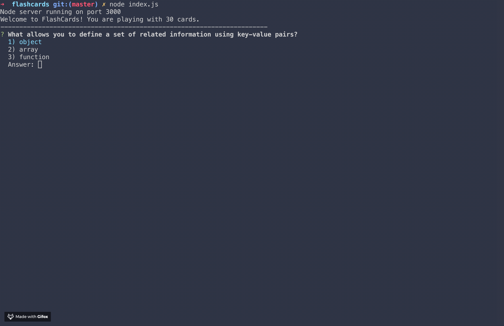

# Flashcards

Flashcards is a solo project designed to introduce test driven development and running applications from the command line. The user starts and plays the game completely in the terminal.

# Demo

## Instructions
1. Clone down repo
2. CD into repo
3. Run "npm install" in the terminal to download all dependencies
4. Run "node index.js" in terminal to start the game 
